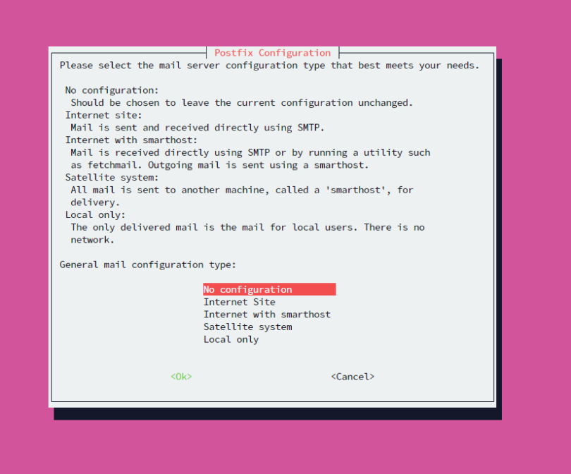

# [TITLE] Linux CybSec

This script is designed to help secure fresh Ubuntu machines

## [SubTitle] To Run Script
Please make sure to run this script in root/sudo
- `sudo apt-get install -y python3`
- `sudo wget https://raw.githubusercontent.com/powerthecoder/Linux-CybSec/main/Scripts/script.py`
- `sudo python3 script.py`

## [SubTitle] Prompts that will appear
You will be asked questions such as what ports to open, and if you want to download a certain type of configuration file over another. In these prompts please type what is needed for your server

 
Please make sure you select the "Keep the local version currently installed" and click enter

 
You can just click enter here

 
You can just click enter here

 
Please type the ports you need open as demonstrated in the terminal

 
You can just click enter here

 
You can just click enter here

 
You can just click enter here

 
Please make sure you select `No Configuration`

 
You can just click enter here

 
If you see any number other than 0 for the boxed information, please open a ticket or contact a system administrator to take a look

Once this script is done running you can delete the `script.py` file by typing the following command:
`sudo rm script.py`
